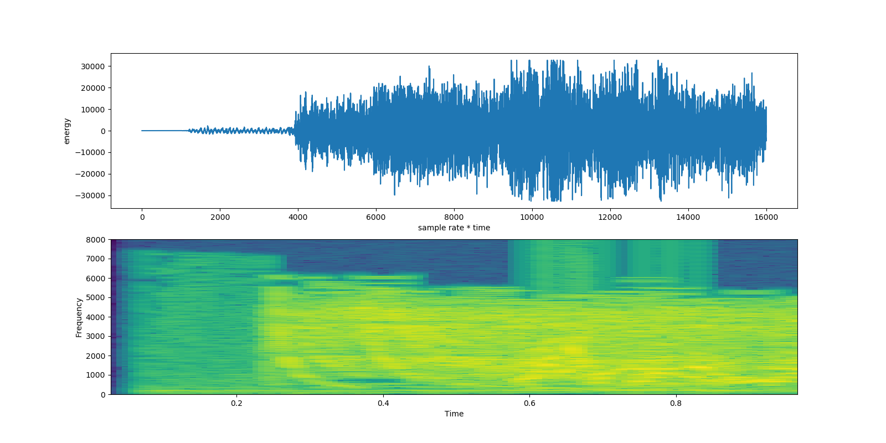
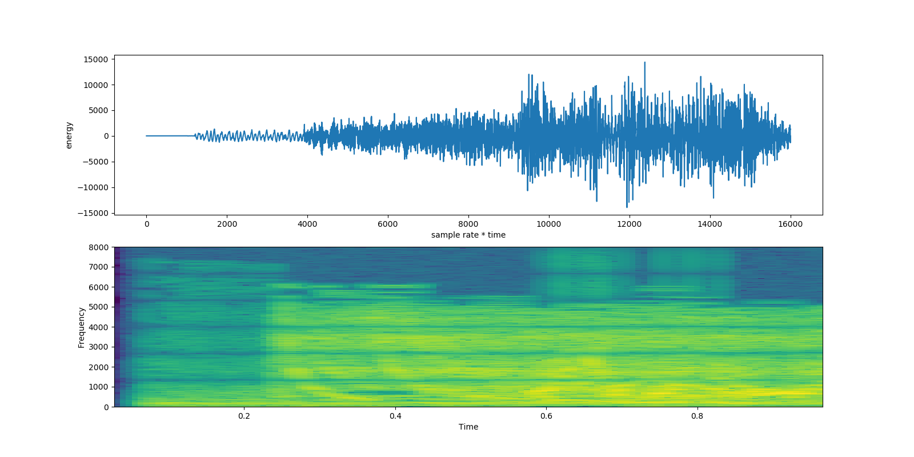
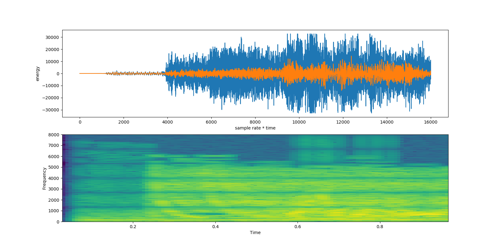

# Audio Transformation using Low Pass Filter

## Setup

I have used Ubuntu for this project, hence i am not sure if one might run into problems while using Windows or MacOS.

The modules/libraries i have used for this project are:
- `matplotlib` for plotting the graphs
- `scipy.io` for wavfile interpretation
- `numpy` for every complex mathematical calculations which may take more steps if i had used the `math` library
- `wave` for file I/O purposes
- `math` for performing basic calculations.

First, you would need to run this. This may be optional if you have not installed the modules mentioned above.

` $ pip install -r requirements.txt`

After making sure you have all necessary modules, run the script using the file `filtration.py`:

`$ python3 filtration.py`
 
The filtered output will be saved in a wav file named `filtered.wav` in the current directory. Once you play the audio, you will notice the difference from the original audio file. Moreover, you will find the graphs saved as `before_filtering.png`, `after_filtering.png` and `comparison.png` for finding the graphs of the wav files before and after filtration process.

## Implementation

In order to filter out the highest frequencies from any audio signal, we need to choose the cutoff frequency and reduce the signals below that cutoff value. In this project, we chose a cutoff frequency of `400.0 Hz`.

For the filtration, we first extract the raw audio, the frame rate, amp width, number of channels and number of frames from the wav file. We then call a method which interprets the input wav file and returns the channel's shape based on the fact that the channels are interleaved or not. The method and it's parameters are given below:
```python
def interpret_wav(raw_bytes, n_frames, n_channels, sample_width, interleaved = True):
```
After the interpretation, we then find the moving average of the channels. The reason why we need this calculations is because we need to filter out the highest frequencies and bring it below the cutoff based on the average we calculate. Just like how mean works, we find the cummulative sum of the channels after interpretation and divide that by the size N. The equation used is given below:


(If you are viewing this markdown file in dark mode, the color of this equation blends with that, you may click on the image above which then redirects you to the equations page).

The method and it's parameters are given below:
```python
def running_mean(x, windowSize):
```

And after finding the running mean, we then write to the output wav file named `filtered.wav` which has the filtered version of the input wav file. Then we analyze the graphs by plotting the wav file on a plot graph and a specgram which gives an detailed output of what the wav file now looks like. You can see how the frequencies have been filtered out once you compare both frequencies.


## Results

The results of the Pacman wav file is given below. As you can see how the audio was filtered based on the resultant output. We plotted two graphs: a plot graph and a specgram to show the differences.

### Before




### After



### Comparison




## References
- [Pacman Audio](https://www.wavsource.com/video_games/pac-man.htm)
- [Moving Average/Running Mean](https://en.wikipedia.org/wiki/Moving_average)
- [Interpreting the Wav data for graphing](http://stackoverflow.com/questions/2226853/interpreting-wav-data/2227174#2227174)
- [How to achieve Window Sizes](http://dsp.stackexchange.com/questions/9966/what-is-the-cut-off-frequency-of-a-moving-average-filter)
- [Theory Part from the course website](https://cmsc388v.gitlab.io/)
